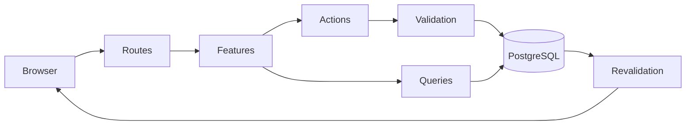
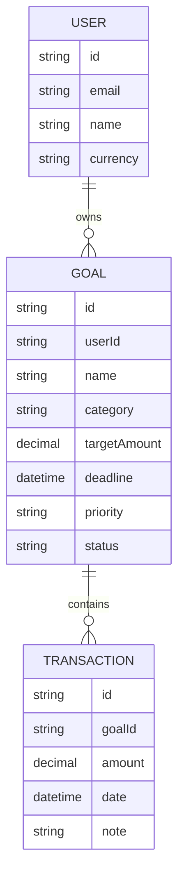

# DreamFund

**Small steps today. Big dreams tomorrow.**

DreamFund is a savings-goal tracker built around **what you're saving for**, not just where your money sits.

Whether it's a Japan trip, an emergency fund, a new laptop, a wedding, or a long-term investment, DreamFund helps you set a target, track contributions, understand what's left, and know how much you need to save each month to reach your goal.

> **Most finance apps tell you where your money went. DreamFund tells you what your money is helping you achieve.**

[Live Demo](https://dreamfund-rose.vercel.app/)

---

## Why DreamFund?

Traditional budgeting apps tend to focus on accounts, transactions, spending categories, and balances.

DreamFund starts from a different question:

**What are you actually saving for?**

A trip isn't just ₹80,000, laptop isn't just ₹1,20,000 and an emergency fund isn't just a balance.

They're goals with a purpose, a target, a deadline, and a story.

DreamFund makes that intent visible.

### Goals are first-class

Every goal has a name, category, priority, target amount, and optional deadline.

### Progress is transparent

See how much you've saved, how much remains, your current progress, and — when applicable — how much you should save each month to stay on track.

### Contributions tell a story

Every deposit is recorded with a date and optional note, giving you a history of how you reached the goal rather than just a final balance.

### Milestones should feel meaningful

Completing a goal triggers a subtle celebration, while respecting `prefers-reduced-motion`.

---

## How It Works

### 1. Create a goal

Define what you're saving for, choose a category and priority, set your target amount, and optionally add a deadline.

### 2. Get a savings target

When a deadline is provided, DreamFund calculates the remaining amount and the approximate monthly amount required to reach the target.

### 3. Add contributions

Record deposits as they happen. Add an optional note to keep context around each contribution.

### 4. Track your progress

The dashboard and goal detail view show your saved amount, remaining balance, progress, and deadline.

### 5. Reach the goal

Once the target is reached, the goal is marked complete and the interface celebrates the milestone.

---

## Features


| Area              | What you get                                                                                          |
| ----------------- | ----------------------------------------------------------------------------------------------------- |
| **Dashboard**     | Active goals, total saved, goal count, amount remaining, and average monthly savings                  |
| **Goals board**   | Search, filter, and sort goals by deadline, progress, priority, category, and status                  |
| **Create & edit** | Goal form with live suggested monthly savings as target and deadline change                           |
| **Goal detail**   | Progress, target, remaining amount, deadline, category, priority, and contribution history            |
| **Deposits**      | Amount, date, and optional note, persisted as transactions                                            |
| **Analytics**     | Completion breakdown, priority distribution, and recent transactions                                  |
| **Settings**      | Profile, currency, notification preferences, CSV export, and data management                          |
| **Polish**        | collapsible sidebar, loading states, empty states, and toasts |

---

## Product Preview

### Dashboard

The dashboard provides a high-level view of savings progress, active goals, and overall momentum.

### Goals

The goals board makes it easy to search, filter, sort, and compare savings goals.

### Goal Detail

Each goal has its own progress view and contribution history.

### Analytics

Analytics provide a broader view of completed goals, priorities, and recent savings activity.

---

## Engineering Highlights

DreamFund is built as a full-stack Next.js application with a focus on clear domain boundaries, reliable money calculations, and server-side data mutations.

### Server Actions

Mutations are handled through Next.js Server Actions rather than exposing a separate API layer.

Each action:

1. Receives form data
2. Validates the input with Zod
3. Performs ownership checks
4. Executes the database mutation
5. Revalidates affected routes
6. Returns a typed `ActionState`


### Database Transactions

Deposits are persisted atomically.

Adding a contribution and updating the corresponding goal state happen within a database transaction, preventing partially applied mutations.

### Money Precision

Financial values are stored using PostgreSQL `Decimal(12, 2)` rather than JavaScript floating-point numbers.

This avoids common floating-point precision problems when working with monetary values.

### Locale-Aware Currency

Currency formatting respects the selected currency and locale.

For INR, DreamFund uses Indian lakh/crore grouping:

```text
₹10,00,000

```

rather than western grouping:

```text
₹1,000,000

```


### Ownership Checks

Goal mutations verify that the requested goal belongs to the current user before allowing updates, deletion, or deposits.

### Domain-Level Testing

Core financial calculations and validation logic are kept independent from the UI so they can be tested directly.

---

## Architecture

DreamFund uses a **feature-first architecture**.

Each product domain owns its own business logic, validation, queries, server actions, and UI rather than placing everything into global folders.

```text
app/
├── _navigation/          # Header + sidebar
├── page.tsx              # Dashboard
├── goals/                # Goals board + goal detail
├── analytics/            # Analytics page
└── settings/             # Settings page

features/
├── goal/
│   ├── components/
│   ├── actions/
│   ├── queries/
│   ├── schemas/
│   └── goal-math/
│
├── analytics/
│   ├── components/
│   ├── queries/
│   └── aggregations/
│
└── settings/
    ├── components/
    └── actions/

components/
└── Shared UI, form components,
    dialogs, and shadcn primitives

lib/
├── Prisma client
├── demo user
└── server/action helpers

utils/
├── money
├── currency
└── date-only helpers

prisma/
├── schema
└── seed

paths.ts                 # Typed route helpers

```

### Request Flow



The architecture keeps routes relatively thin while allowing each feature to own the logic it needs.

---

## Data Model

The core data model is intentionally small.



The model keeps goals and their contribution history separate, allowing the application to derive progress and analytics from actual transaction data.

---

## Savings Calculations

One of the core pieces of domain logic is determining how much a user needs to save each month.

For a goal with a future deadline:

```text
remaining amount
÷
remaining calendar months
=
suggested monthly savings

```

The result is rounded up so that the suggested amount does not leave the user short of the target.

Goals without deadlines do not display a monthly savings recommendation.

### Progress Rules

DreamFund also deliberately avoids misleading progress states.

- In-progress goals don't display `0%` as meaningful progress.
- `100%` is reserved for goals that have actually reached their target.
- Progress is capped at the target amount.
- Remaining amount never becomes negative in the UI.
- Completed goals are represented as completed rather than simply showing a full progress bar.

These rules keep financial feedback predictable and honest.

---

## Tech Stack

| Layer                | Technology             |
| -------------------- | ---------------------- |
| **Framework**        | Next.js 16             |
| **UI**               | React 19               |
| **Language**         | TypeScript             |
| **Database**         | PostgreSQL             |
| **ORM**              | Prisma 7               |
| **Database Adapter** | `@prisma/adapter-pg`   |
| **Validation**       | Zod                    |
| **Styling**          | Tailwind CSS 4         |
| **UI Components**    | shadcn/ui + Radix      |
| **Animation**        | Motion                 |
| **Charts**           | Recharts               |
| **Date Handling**    | date-fns               |
| **Goal Completion**  | canvas-confetti        |
| **Testing**          | Node test runner + tsx |


---

## Testing

DreamFund uses Node's built-in test runner rather than introducing a separate test framework.

The test suite focuses primarily on **domain logic, validation, and data transformations** rather than implementation details of individual UI components.

### Covered Areas

- Goal progress calculations
- Remaining amount calculations
- Suggested monthly savings
- Deadline calculations
- Money formatting
- Currency formatting
- Goal validation
- Form schemas
- Analytics aggregations
- Transaction-related calculations
- Date-only utilities
- Edge cases around completed and overdue goals

Tests live close to the code they protect.

```text
features/
├── goal/
│   ├── goal-math.test.ts
│   └── schemas.test.ts
│
├── analytics/
│   └── analytics.test.ts
│
utils/
├── money.test.ts
└── date-only.test.ts

```

Run the test suite with:

```bash
npm test

```

---

## Current MVP Scope

DreamFund currently runs as a **single-user demo** so the complete product can be explored without an authentication flow.

### Available

- Goal creation and editing
- Goal deletion
- Goal categorisation
- Priorities
- Deadlines
- Contribution tracking
- Goal progress calculations
- Dashboard
- Goals board
- Goal detail pages
- Analytics
- CSV export
- Currency preferences
- Light/dark theme
- Responsive navigation
- Empty and loading states
- Toast feedback
- Goal completion celebration
- PostgreSQL persistence

### Not Yet Implemented

- Authentication
- Multiple user accounts
- Recurring contributions
- Bank account integrations
- Automated notifications
- Push notifications
- Shared goals
- Production financial integrations

These are intentionally outside the current MVP scope.

---

## Roadmap

### Next

- Authentication and user accounts
- Multi-user data isolation
- Recurring savings contributions
- Goal completion history
- More detailed savings trends

### Later

- Email and push reminders
- Savings streaks
- Monthly savings insights
- Shared goals
- Account / bank integrations

### Exploring

- What-if goal projections
- Smarter savings recommendations
- AI-assisted financial goal planning
- Investment-linked goals

---

## Product Decisions

### Why goals instead of accounts?

DreamFund is designed around **financial intent**.

The application doesn't try to replace a bank account or become a complete budgeting platform. Instead, it provides a focused layer for answering:

> "Am I on track to achieve this specific thing?"


### Why optional deadlines?

Not every financial goal has a meaningful deadline.

An emergency fund may be ongoing, while a vacation or wedding may have a fixed date. DreamFund therefore treats deadlines as optional rather than forcing every goal into a time-based savings plan.

### Why contribution history?

A final balance tells you where you are.

A contribution history tells you how you got there.

Keeping deposits as individual transactions makes the progress history useful for both the user and future analytics.

### Why celebrate completion?

Savings goals are behavioral products as much as financial ones.

Reaching a target is a milestone, so the interface acknowledges it rather than treating completion as another database state.

---

## Demo Data

The demo seed creates:

**User**

```text
demo@dreamfund.app

```

**Goals**

- Emergency Fund
- Japan Trip
- New Laptop

Each goal includes sample contribution history so the Dashboard and Analytics views are populated immediately.

---

## Project Structure

The application is intentionally organized around product domains rather than technical layers.

```text
DreamFund
│
├── app
│   ├── Dashboard
│   ├── Goals
│   ├── Analytics
│   └── Settings
│
├── features
│   ├── Goal
│   ├── Analytics
│   └── Settings
│
├── components
│   └── Shared UI
│
├── lib
│   └── Application infrastructure
│
├── utils
│   └── Domain utilities
│
└── prisma
    └── Database schema + seed

```

This structure makes it easier to extend the application as new product areas are introduced.

---

## What I Wanted to Explore

DreamFund was built as an opportunity to explore the intersection of:

- Fintech product design
- Goal-oriented UX
- Financial data modelling
- Reliable monetary calculations
- Next.js Server Actions
- Prisma and PostgreSQL
- Feature-first application architecture
- Accessible and responsive dashboard design
- Domain-level testing

The project deliberately keeps the product scope narrow while allowing the underlying architecture to support future expansion.

---

## License

Private project.

Not licensed for reuse, redistribution, or commercial use unless explicitly permitted by the author.